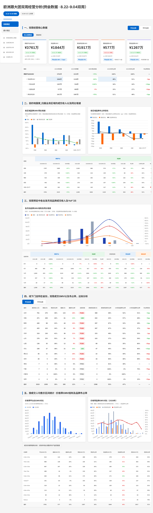
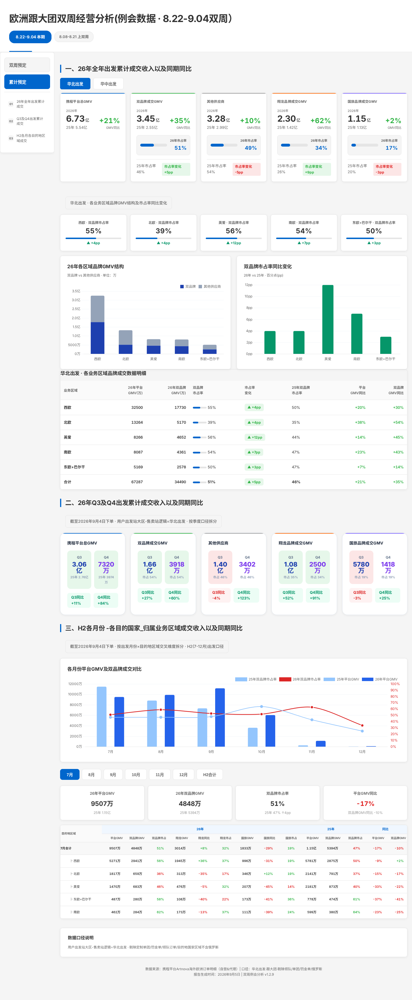

::: {.header}
::: {.header-content}
欧洲跟大团双周经营分析(例会数据 · 8.22-9.04双周）
=================================================

::: {.history-nav}
[8.22-9.04 本期]{.history-tag .active} [8.08-8.21
上双周](双周例会分析报告_08.08-08.21.html){.history-tag}
:::
:::
:::

::: {.main-layout}
::: {.sidebar-nav}
::: {.sidebar-panel}
::: {.sidebar-tabs}
双周预定

累计预定
:::

::: {.sidebar-divider}
:::

::: {.sidebar-group tab="biweekly"}
[[01]{.sidebar-num}双周经营核心数据]{.sidebar-link}
[[02]{.sidebar-num}业务区域分析]{.sidebar-link}
[[03]{.sidebar-num}出发月份分布]{.sidebar-link}
[[04]{.sidebar-num}省份达标分析]{.sidebar-link}
[[05]{.sidebar-num}价格带分布]{.sidebar-link}
:::

::: {.sidebar-group tab="cumulative" style="display:none"}
[[01]{.sidebar-num}26年全年出发累计成交]{.sidebar-link}
[[02]{.sidebar-num}Q3及Q4出发累计成交]{.sidebar-link}
[[03]{.sidebar-num}H2各月各目的地区域成交]{.sidebar-link}
:::
:::
:::

::: {.main-content}
::: {#tab-biweekly .tab-panel .active}
::: {.section-header}
::: {#bw-core .section-title}
一、双周经营核心数据
:::

::: {.region-tabs}
华北出发

华中出发
:::
:::

::: {#bw-region-hb .bw-region-panel .active}
::: {.sub-tabs}
核心经营数据

渠道表现
:::

::: {#hb-core .sub-panel .active}
::: {.kpi-grid .five}
::: {.kpi-card}
::: {.kpi-label}
携程平台总GMV
:::

::: {.kpi-value}
¥3761万
:::

::: {.kpi-meta}
[[YoY\'25]{.small} ↑ +70%]{.kpi-yoy .yoy-up}[vs 25年
¥2215万]{.kpi-compare}
:::

::: {.kpi-note}
成交人数 1,936人（+99%）
:::
:::

::: {.kpi-card .green}
::: {.kpi-label}
双品牌GMV
:::

::: {.kpi-value}
¥1844万
:::

::: {.kpi-meta}
[[YoY\'25]{.small} ↑ +63%]{.kpi-yoy .yoy-up}[vs 25年
¥1129万]{.kpi-compare}
:::

::: {.kpi-note}
[平台占比 49%（-2pp）]{.kpi-share}
:::
:::

::: {.kpi-card .red}
::: {.kpi-label}
其他供应商GMV
:::

::: {.kpi-value}
¥1917万
:::

::: {.kpi-meta}
[[YoY\'25]{.small} ↑ +76%]{.kpi-yoy .yoy-up}[vs 25年
¥1087万]{.kpi-compare}
:::

::: {.kpi-note}
[平台占比 51%]{.kpi-share}
:::
:::

::: {.kpi-card .orange}
::: {.kpi-label}
国旅品牌GMV
:::

::: {.kpi-value}
¥577万
:::

::: {.kpi-meta}
[[YoY\'25]{.small} ↓ -5%]{.kpi-yoy .yoy-down}[vs 25年
¥605万]{.kpi-compare}
:::

::: {.kpi-note}
[平台占比 15%]{.kpi-share}，增速低于大盘
:::
:::

::: {.kpi-card .purple}
::: {.kpi-label}
翔龙品牌GMV
:::

::: {.kpi-value}
¥1267万
:::

::: {.kpi-meta}
[[YoY\'25]{.small} ↑ +142%]{.kpi-yoy .yoy-up}[vs 25年
¥524万]{.kpi-compare}
:::

::: {.kpi-note}
[平台占比 34%]{.kpi-share}，增速跑赢大盘
:::
:::
:::

  指标            2026年双周   2025年同期   GMV同比增长   2026年市占率   2025年市占率   市占率变化
  --------------- ------------ ------------ ------------- -------------- -------------- ------------
  携程平台总GMV   3761万       2215万       +70%          100%           100%           ---
  ├ 双品牌GMV     1844万       1129万       +63%          49%            51%            -2pp
  ├ 翔龙品牌      1267万       524万        +142%         34%            24%            +10pp
  ├ 国旅品牌      577万        605万        -5%           15%            27%            -12pp
  └ 其他供应商    1917万       1087万       +76%          51%            49%            +2pp
:::

::: {#hb-channel .sub-panel}
::: {.channel-section}
::: {.channel-grid}
::: {.channel-card .primary}
::: {.channel-header}
[线下门店]{.channel-name}
:::

::: {.channel-body}
::: {.channel-kpi-row}
::: {.channel-kpi}
::: {.channel-kpi-label}
携程平台成交收入
:::

::: {.channel-kpi-value}
¥3019万
:::

::: {.channel-kpi-yoy .up}
[YoY\'25]{style="font-size:10px; color:#94a3b8"} +88%
:::
:::

::: {.channel-kpi}
::: {.channel-kpi-label}
双品牌市占率
:::

::: {.channel-kpi-value style="color:#059669"}
47%
:::

::: {.channel-kpi-yoy .up}
同比 +1pp
:::
:::

::: {.channel-kpi}
::: {.channel-kpi-label}
其他供应商市占率
:::

::: {.channel-kpi-value style="color:#64748b"}
53%
:::

::: {.channel-kpi-yoy .down}
同比 -1pp
:::
:::
:::

::: {.brand-mini-grid}
::: {.brand-mini .xl}
::: {.brand-mini-name}
翔龙品牌
:::

::: {style="font-size:10px; color:#94a3b8"}
成交GMV
:::

::: {.brand-mini-gmv}
¥1058万
:::

::: {style="font-size:10px; color:#94a3b8"}
YoY\'25
:::

::: {.brand-mini-yoy .up}
↑ +133%
:::

::: {style="font-size:10px; color:#94a3b8"}
市占率
:::

::: {.brand-mini-share .xl}
35%
:::
:::

::: {.brand-mini .gl}
::: {.brand-mini-name}
国旅品牌
:::

::: {style="font-size:10px; color:#94a3b8"}
成交GMV
:::

::: {.brand-mini-gmv}
¥365万
:::

::: {style="font-size:10px; color:#94a3b8"}
YoY\'25
:::

::: {.brand-mini-yoy .up}
↑ +27%
:::

::: {style="font-size:10px; color:#94a3b8"}
市占率
:::

::: {.brand-mini-share .gl}
12%
:::
:::

::: {.brand-mini .ot}
::: {.brand-mini-name}
其他供应商
:::

::: {style="font-size:10px; color:#94a3b8"}
成交GMV
:::

::: {.brand-mini-gmv}
¥1596万
:::

::: {style="font-size:10px; color:#94a3b8"}
YoY\'25
:::

::: {.brand-mini-yoy .up}
↑ +84%
:::

::: {style="font-size:10px; color:#94a3b8"}
市占率
:::

::: {.brand-mini-share .ot}
53%
:::
:::
:::
:::
:::

::: {.channel-card}
::: {.channel-header}
[线上渠道]{.channel-name}
:::

::: {.channel-body}
::: {.channel-kpi-row}
::: {.channel-kpi}
::: {.channel-kpi-label}
携程平台成交收入
:::

::: {.channel-kpi-value}
¥742万
:::

::: {.channel-kpi-yoy .up}
[YoY\'25]{style="font-size:10px; color:#94a3b8"} +22%
:::
:::

::: {.channel-kpi}
::: {.channel-kpi-label}
双品牌市占率
:::

::: {.channel-kpi-value style="color:#059669"}
57%
:::

::: {.channel-kpi-yoy .down}
同比 -7pp
:::
:::

::: {.channel-kpi}
::: {.channel-kpi-label}
其他供应商市占率
:::

::: {.channel-kpi-value style="color:#64748b"}
43%
:::

::: {.channel-kpi-yoy .up}
同比 +7pp
:::
:::
:::

::: {.brand-mini-grid}
::: {.brand-mini .xl}
::: {.brand-mini-name}
翔龙品牌
:::

::: {style="font-size:10px; color:#94a3b8"}
成交GMV
:::

::: {.brand-mini-gmv}
¥209万
:::

::: {style="font-size:10px; color:#94a3b8"}
YoY\'25
:::

::: {.brand-mini-yoy .up}
↑ +198%
:::

::: {style="font-size:10px; color:#94a3b8"}
市占率
:::

::: {.brand-mini-share .xl}
28%
:::
:::

::: {.brand-mini .gl}
::: {.brand-mini-name}
国旅品牌
:::

::: {style="font-size:10px; color:#94a3b8"}
成交GMV
:::

::: {.brand-mini-gmv}
¥213万
:::

::: {style="font-size:10px; color:#94a3b8"}
YoY\'25
:::

::: {.brand-mini-yoy .down}
↑ -33%
:::

::: {style="font-size:10px; color:#94a3b8"}
市占率
:::

::: {.brand-mini-share .gl}
29%
:::
:::

::: {.brand-mini .ot}
::: {.brand-mini-name}
其他供应商
:::

::: {style="font-size:10px; color:#94a3b8"}
成交GMV
:::

::: {.brand-mini-gmv}
¥321万
:::

::: {style="font-size:10px; color:#94a3b8"}
YoY\'25
:::

::: {.brand-mini-yoy .up}
↑ +46%
:::

::: {style="font-size:10px; color:#94a3b8"}
市占率
:::

::: {.brand-mini-share .ot}
43%
:::
:::
:::
:::
:::
:::

::: {style="margin-top:16px"}
渠道
:::
:::
:::
:::
:::
:::
:::

品牌

2026GMV(万)

25年GMV(万)

GMV同比

市占率

市占率变化

线下门店

携程平台

3019

1609

+88%

100%

---

其他供应商

1596

867

+84%

53%

[↓ -1pp]{.tag .down}

双品牌

1423

741

+92%

47%

[↑ +1pp]{.tag .up}

├ 翔龙品牌

1058

454

+133%

35%

[↑ +7pp]{.tag .up}

└ 国旅品牌

365

288

+27%

12%

[↓ -6pp]{.tag .down}

线上渠道

携程平台

742

606

+22%

100%

---

其他供应商

321

219

+46%

43%

[↑ +7pp]{.tag .up}

双品牌

422

387

+9%

57%

[↓ -7pp]{.tag .down}

├ 翔龙品牌

209

70

+198%

28%

[↑ +17pp]{.tag .up}

└ 国旅品牌

213

317

-33%

29%

[↓ -24pp]{.tag .down}

::: {#bw-region-hz .bw-region-panel}
::: {.sub-tabs}
核心经营数据

渠道表现
:::

::: {#hz-core .sub-panel .active}
::: {.kpi-grid .four}
::: {.kpi-card}
::: {.kpi-label}
携程平台总GMV
:::

::: {.kpi-value}
683万
:::

::: {.kpi-meta}
[[YoY\'25]{.small} ↑ +117%]{.kpi-yoy .yoy-up}[vs 315万]{.kpi-compare}
:::
:::

::: {.kpi-card .green}
::: {.kpi-label}
双品牌成交GMV
:::

::: {.kpi-value}
292万
:::

::: {.kpi-meta}
[[YoY\'25]{.small} ↑ +175%]{.kpi-yoy .yoy-up}[vs 106万]{.kpi-compare}
:::

::: {.kpi-share-bar}
::: {.kpi-share-fill style="width:43%"}
:::
:::

::: {.kpi-note}
市占率 43% [↑ +9pp]{.change-pill .up}
:::
:::

::: {.kpi-card .orange}
::: {.kpi-label}
翔龙品牌成交GMV
:::

::: {.kpi-value}
231万
:::

::: {.kpi-meta}
[[YoY\'25]{.small} ↑ +194%]{.kpi-yoy .yoy-up}[vs 79万]{.kpi-compare}
:::

::: {.kpi-share-bar}
::: {.kpi-share-fill style="width:34%"}
:::
:::

::: {.kpi-note}
市占率 34% [↑ +9pp]{.change-pill .up}
:::
:::

::: {.kpi-card .purple}
::: {.kpi-label}
国旅品牌成交GMV
:::

::: {.kpi-value}
61万
:::

::: {.kpi-meta}
[[YoY\'25]{.small} ↑ +120%]{.kpi-yoy .yoy-up}[vs 28万]{.kpi-compare}
:::

::: {.kpi-share-bar}
::: {.kpi-share-fill style="width:9%"}
:::
:::

::: {.kpi-note}
市占率 9% [↑ +0pp]{.change-pill .up}
:::
:::
:::
:::

::: {#hz-channel .sub-panel}
::: {.channel-section}
::: {.channel-grid}
::: {.channel-card .primary}
::: {.channel-header}
[线下门店]{.channel-name}
:::

::: {.channel-body}
::: {.channel-kpi-row}
::: {.channel-kpi}
::: {.channel-kpi-label}
携程平台成交收入
:::

::: {.channel-kpi-value}
¥615万
:::
:::

::: {.channel-kpi}
::: {.channel-kpi-label}
双品牌市占率
:::

::: {.channel-kpi-value style="color:#059669"}
41%
:::
:::

::: {.channel-kpi}
::: {.channel-kpi-label}
其他供应商市占率
:::

::: {.channel-kpi-value style="color:#64748b"}
59%
:::
:::
:::

::: {.brand-mini-grid}
::: {.brand-mini .xl}
::: {.brand-mini-name}
翔龙品牌
:::

::: {style="font-size:10px; color:#94a3b8"}
成交GMV
:::

::: {.brand-mini-gmv}
¥199万
:::

::: {style="font-size:10px; color:#94a3b8"}
市占率
:::

::: {.brand-mini-share .xl}
32%
:::
:::

::: {.brand-mini .gl}
::: {.brand-mini-name}
国旅品牌
:::

::: {style="font-size:10px; color:#94a3b8"}
成交GMV
:::

::: {.brand-mini-gmv}
¥52万
:::

::: {style="font-size:10px; color:#94a3b8"}
市占率
:::

::: {.brand-mini-share .gl}
8%
:::
:::

::: {.brand-mini .ot}
::: {.brand-mini-name}
其他供应商
:::

::: {style="font-size:10px; color:#94a3b8"}
成交GMV
:::

::: {.brand-mini-gmv}
¥364万
:::

::: {style="font-size:10px; color:#94a3b8"}
市占率
:::

::: {.brand-mini-share .ot}
59%
:::
:::
:::
:::
:::

::: {.channel-card}
::: {.channel-header}
[线上渠道]{.channel-name}
:::

::: {.channel-body}
::: {.channel-kpi-row}
::: {.channel-kpi}
::: {.channel-kpi-label}
携程平台成交收入
:::

::: {.channel-kpi-value}
¥69万
:::
:::

::: {.channel-kpi}
::: {.channel-kpi-label}
双品牌市占率
:::

::: {.channel-kpi-value style="color:#059669"}
61%
:::
:::

::: {.channel-kpi}
::: {.channel-kpi-label}
其他供应商市占率
:::

::: {.channel-kpi-value style="color:#64748b"}
39%
:::
:::
:::

::: {.brand-mini-grid}
::: {.brand-mini .xl}
::: {.brand-mini-name}
翔龙品牌
:::

::: {style="font-size:10px; color:#94a3b8"}
成交GMV
:::

::: {.brand-mini-gmv}
¥33万
:::

::: {style="font-size:10px; color:#94a3b8"}
市占率
:::

::: {.brand-mini-share .xl}
48%
:::
:::

::: {.brand-mini .gl}
::: {.brand-mini-name}
国旅品牌
:::

::: {style="font-size:10px; color:#94a3b8"}
成交GMV
:::

::: {.brand-mini-gmv}
¥9万
:::

::: {style="font-size:10px; color:#94a3b8"}
市占率
:::

::: {.brand-mini-share .gl}
14%
:::
:::

::: {.brand-mini .ot}
::: {.brand-mini-name}
其他供应商
:::

::: {style="font-size:10px; color:#94a3b8"}
成交GMV
:::

::: {.brand-mini-gmv}
¥27万
:::

::: {style="font-size:10px; color:#94a3b8"}
市占率
:::

::: {.brand-mini-share .ot}
39%
:::
:::
:::
:::
:::
:::

::: {style="margin-top:16px"}
  业务渠道   携程平台GMV(万)   双品牌GMV(万)   双品牌市占率   其他GMV(万)   其他市占率   翔龙GMV(万)   翔龙市占率   国旅GMV(万)   国旅市占率
  ---------- ----------------- --------------- -------------- ------------- ------------ ------------- ------------ ------------- ------------
  线下门店   615               250             41%            364           59%          199           32%          52            8%
  线上渠道   69                42              61%            27            39%          33            48%          9             14%
:::
:::
:::
:::

::: {#bw-region .section-title}
二、目的地国家\_归属业务区域的成交收入以及同比增速
:::

::: {.chart-grid}
::: {.chart-card .half}
::: {.chart-title}
各区域品牌GMV同比增速
:::

::: {.chart-subtitle}
按双品牌同比增速降序 · 柱状：翔龙/国旅/其他供应商GMV同比增速（%）\|
折线：双品牌同比增速（%）
:::

::: {.legend-custom}
::: {.legend-item}
::: {.legend-dot style="background:#0066CC"}
:::

翔龙
:::

::: {.legend-item}
::: {.legend-dot style="background:#FF6600"}
:::

国旅
:::

::: {.legend-item}
::: {.legend-dot style="background:#999999"}
:::

其他供应商
:::

::: {.legend-item}
::: {.legend-dot style="background:#2FB344; border-radius:50%"}
:::

双品牌
:::
:::

::: {.chart-wrapper}
:::
:::

::: {.chart-card .half}
::: {.chart-title}
各区域品牌市占率变化
:::

::: {.chart-subtitle}
与左图同区域顺序 · 柱状：翔龙/国旅市占率同比变化（pp）\|
折线：双品牌净变化
:::

::: {.legend-custom}
::: {.legend-item}
::: {.legend-dot style="background:#0066CC"}
:::

翔龙变化
:::

::: {.legend-item}
::: {.legend-dot style="background:#FF6600"}
:::

国旅变化
:::

::: {.legend-item}
::: {.legend-dot style="background:#333333; border-radius:50%"}
:::

双品牌净变化
:::
:::

::: {.chart-wrapper}
:::
:::
:::

::: {.region-table-wrap style="margin-top:20px"}
区域
:::

携程平台

双品牌

其他供应商

翔龙品牌

国旅品牌

2026GMV(万)

2025GMV(万)

GMV同比

2026人数

2026GMV(万)

2025GMV(万)

GMV同比

2026人数

市占率

25年市占率

市占率变化

2026GMV(万)

2025GMV(万)

GMV同比

2026人数

市占率

25年市占率

市占率变化

2026GMV(万)

2025GMV(万)

GMV同比

2026人数

市占率

25年市占率

市占率变化

2026GMV(万)

2025GMV(万)

GMV同比

2026人数

市占率

25年市占率

市占率变化

西欧

1787

1069

+67%

1,004

980

574

+71%

532

55%

54%

▲ +1pp

807

495

+63%

472

45%

46%

▼ -1pp

664

243

+173%

396

37%

23%

▲ +14pp

316

331

-5%

136

18%

31%

▼ -13pp

北欧

670

335

+100%

318

214

139

+54%

84

32%

41%

▼ -9pp

456

197

+132%

234

68%

59%

▲ +9pp

159

67

+137%

63

24%

20%

▲ +4pp

55

71

-23%

21

8%

21%

▼ -13pp

南欧

522

348

+50%

243

282

182

+55%

142

54%

52%

▲ +2pp

240

166

+45%

101

46%

48%

▼ -2pp

201

107

+88%

112

38%

31%

▲ +8pp

81

75

+8%

30

16%

22%

▼ -6pp

英爱

402

202

+100%

179

224

107

+109%

104

56%

53%

▲ +3pp

179

95

+89%

75

44%

47%

▼ -3pp

194

50

+288%

89

48%

25%

▲ +23pp

29

57

-48%

15

7%

28%

▼ -21pp

东欧+巴尔干

380

262

+45%

192

145

127

+14%

72

38%

49%

▼ -10pp

234

134

+74%

120

62%

51%

▲ +10pp

49

57

-13%

28

13%

22%

▼ -9pp

96

71

+36%

44

25%

27%

▼ -2pp

合计

3761

2215

+70%

1,936

1844

1129

+63%

934

49%

51%

▼ -2pp

1917

1087

+76%

1,002

51%

49%

▲ +2pp

1267

524

+142%

688

34%

24%

▲ +10pp

577

605

-5%

246

15%

27%

▼ -12pp

::: {#bw-month .section-title}
三、双周预定中各出发月双品牌成交收入及YoY\'25
:::

::: {.chart-grid}
::: {.chart-card .wide}
::: {.chart-title}
各月份品牌GMV结构及同比增速
:::

::: {.chart-subtitle}
柱状：2026年品牌成交收入构成（万元·左轴） \|
折线：双品牌/翔龙/国旅同比增速（%·右轴）
:::

::: {.legend-custom}
::: {.legend-item}
::: {.legend-dot style="background:#1e40af"}
:::

翔龙
:::

::: {.legend-item}
::: {.legend-dot style="background:#f97316"}
:::

国旅
:::

::: {.legend-item}
::: {.legend-dot style="background:#94a3b8"}
:::

其他供应商
:::

::: {.legend-item}
::: {.legend-dot style="background:#dc2626; border-radius:50%"}
:::

双品牌同比
:::

::: {.legend-item}
::: {.legend-dot style="background:#1e40af; border-radius:50%"}
:::

翔龙同比
:::

::: {.legend-item}
::: {.legend-dot style="background:#f97316; border-radius:50%"}
:::

国旅同比
:::
:::

::: {.chart-wrapper}
:::
:::
:::

::: {style="margin-top:20px"}
:::

::: {style="overflow-x: auto"}
出发月份
:::

携程平台

双品牌

其他供应商

翔龙品牌

国旅品牌

2026人数

2025人数

人数同比

2026GMV(万)

2025GMV(万)

GMV同比

GMV(万)

GMV同比

市占率

GMV(万)

GMV同比

GMV(万)

GMV同比

GMV(万)

GMV同比

8月

8

4

+100%

8

8

-7%

0

-100%

0%

8

+65%

0

-100%

0

---

9月

490

455

+8%

1092

1059

+3%

417

-33%

38%

675

+55%

283

+17%

134

-65%

10月

1,083

423

+156%

2122

997

+113%

1081

+145%

51%

1041

+87%

699

+191%

382

+89%

11月

337

72

+368%

501

119

+321%

337

+590%

67%

164

+134%

276

+846%

61

+211%

12月

18

17

+6%

38

31

+24%

10

-11%

25%

29

+42%

10

+12%

0

-100%

合计

1,936

971

+99%

3761

2215

+70%

1844

+63%

49%

1917

+76%

1267

+142%

577

-5%

::: {#bw-province .section-title}
四、线下门店所在省份，双周成交GMV以及市占率，达标分析
:::

::: {.region-tabs}
华北出发

华中出发
:::

::: {#bw-region-hb-province .bw-region-panel .active}
  省份     成交收入(万)   翔龙(万)   翔龙市占率   国旅(万)   国旅市占率   达标状态                 其他供应商(万)   其他供应商市占率   26年双品牌市占率   25年双品牌市占率   市占率变化
  -------- -------------- ---------- ------------ ---------- ------------ ------------------------ ---------------- ------------------ ------------------ ------------------ ------------
  北京     761            270        36%          123        16%          [不达标]{.status-fail}   368              48%                52%                51%                +0pp
  河南     471            209        44%          61         13%          [达标]{.status-pass}     202              43%                57%                49%                +8pp
  陕西     440            99         22%          44         10%          [不达标]{.status-fail}   297              67%                33%                29%                +4pp
  辽宁     425            103        24%          35         8%           [不达标]{.status-fail}   287              67%                33%                37%                -4pp
  天津     319            130        41%          36         11%          [不达标]{.status-fail}   153              48%                52%                53%                -1pp
  山东     276            153        55%          20         7%           [不达标]{.status-fail}   103              37%                63%                54%                +9pp
  山西     136            35         26%          12         9%           [不达标]{.status-fail}   89               65%                35%                60%                -25pp
  河北     106            37         36%          21         20%          [达标]{.status-pass}     47               45%                55%                40%                +15pp
  黑龙江   40             11         28%          7          16%          [不达标]{.status-fail}   22               56%                44%                63%                -19pp
  吉林     26             5          19%          5          21%          [不达标]{.status-fail}   16               60%                40%                68%                -29pp
  青海     7              3          39%          0          0%           [不判定]{.status-na}     4                61%                39%                ---                ---
  宁夏     7              0          0%           0          0%           [不判定]{.status-na}     7                100%               0%                 70%                -70pp
  内蒙古   3              3          100%         0          0%           [不判定]{.status-na}     0                0%                 100%               ---                ---
  甘肃     2              0          0%           0          0%           [不判定]{.status-na}     2                100%               0%                 15%                -15pp
  合计     3019           1058       35%          365        12%          ---                      1596             53%                47%                ---                ---
:::

::: {#bw-region-hz-province .bw-region-panel}
::: {.section-subtitle}
业务渠道聚合=线下门店 · 华中出发(湖北、湖南) · 8月7日-8月21日双周预订
:::

::: {.chart-grid}
::: {.chart-card .half}
::: {.chart-title}
线下门店省份品牌市占率
:::

::: {.chart-subtitle}
26年双周 · 翔龙/国旅/其他供应商 各品牌GMV ÷ 平台总GMV · 环形图直观对比
:::

::: {style="display:flex; gap:12px; align-items:center; justify-content:center; height:260px"}
::: {style="flex:1; text-align:center; position:relative"}
::: {style="font-size:14px; font-weight:700; color:#1e293b; margin-bottom:4px"}
湖南
:::

::: {style="font-size:11px; color:#64748b; margin-bottom:4px"}
平台GMV 290万
:::

::: {.chart-wrapper style="height:180px"}
:::
:::

::: {style="width:1px; height:160px"}
:::

::: {style="flex:1; text-align:center; position:relative"}
::: {style="font-size:14px; font-weight:700; color:#1e293b; margin-bottom:4px"}
湖北
:::

::: {style="font-size:11px; color:#64748b; margin-bottom:4px"}
平台GMV 325万
:::

::: {.chart-wrapper style="height:180px"}
:::
:::
:::
:::

::: {.chart-card .half}
::: {.chart-title}
线下门店省份品牌GMV结构
:::

::: {.chart-subtitle}
26年双周 · 堆叠展示各省品牌构成及总GMV对比
:::

::: {.chart-wrapper}
:::
:::
:::

::: {style="margin-top:20px"}
:::

::: {.section-subtitle style="margin-left:0; font-weight:600"}
华中线下门店省份成交结构分析
:::

  省份       平台GMV(万)   双品牌GMV(万)   双品牌市占率   其他供应商GMV(万)   其他市占率   翔龙品牌GMV(万)   翔龙市占率   国旅品牌GMV(万)   国旅市占率
  ---------- ------------- --------------- -------------- ------------------- ------------ ----------------- ------------ ----------------- ------------
  湖北       325万         151万           47%            174万               53%          128万             40%          23万              7%
  湖南       290万         99万            34%            191万               66%          70万              24%          29万              10%
  **合计**   **615万**     **250万**       **41%**        **364万**           **59%**      **199万**         **32%**      **52万**          **8%**
:::

::: {#bw-price .section-title}
五、按成交人均售价区间统计 · 价格带GMV结构及品牌市占率
:::

::: {.chart-grid}
::: {.chart-card .half}
::: {.chart-title}
价格带平台总GMV对比
:::

::: {.chart-subtitle}
2025 vs 2026 各价格带成交收入（万元）
:::

::: {.legend-custom}
::: {.legend-item}
::: {.legend-dot style="background:#93c5fd"}
:::

2025年
:::

::: {.legend-item}
::: {.legend-dot style="background:#2563eb"}
:::

2026年
:::
:::

::: {.chart-wrapper}
:::
:::

::: {.chart-card .half}
::: {.chart-title}
价格带品牌GMV对比（2026年）
:::

::: {.chart-subtitle}
翔龙 · 国旅 · 其他供应商 各价格带成交收入（万元）+ 双品牌市占率
:::

::: {.legend-custom}
::: {.legend-item}
::: {.legend-dot style="background:#2563eb"}
:::

翔龙
:::

::: {.legend-item}
::: {.legend-dot style="background:#f97316"}
:::

国旅
:::

::: {.legend-item}
::: {.legend-dot style="background:#94a3b8"}
:::

其他供应商
:::

::: {.legend-item}
::: {.legend-dot style="background:#dc2626; border-radius:50%"}
:::

双品牌市占率
:::
:::

::: {.chart-wrapper}
:::
:::
:::

::: {style="margin-top:20px"}
:::

::: {.section-subtitle style="margin-left:0; font-weight:600"}
成交价格带结构分析：识别市场主流需求与产品匹配度
:::

  价格带      平台GMV(万)   国旅GMV(万)   国旅市占率   翔龙GMV(万)   翔龙市占率   双品牌GMV(万)   双品牌市占率   其他GMV(万)   其他市占率
  ----------- ------------- ------------- ------------ ------------- ------------ --------------- -------------- ------------- ------------
  2.0w-2.5w   813           110           13%          269           33%          379             47%            434           53%
  1.5w-2.0w   686           138           20%          145           21%          283             41%            403           59%
  2.5w-3.0w   667           167           25%          228           34%          395             59%            272           41%
  1.0w-1.5w   489           18            4%           219           45%          237             48%            252           52%
  3.0w-3.5w   464           96            21%          175           38%          271             58%            193           42%
  1.0w以下    241           0.8           0%           103           43%          104             43%            137           57%
  3.5w-4.0w   219           22            10%          83            38%          105             48%            113           52%
  4.0w-4.5w   113           13            11%          33            29%          46              41%            67            59%
  4.5w-5.0w   38            14            36%          5             12%          18              49%            19            51%
  5w以上      32            0             0%           7             21%          7               21%            25            79%
  合计        3761          577           15%          1267          34%          1844            49%            1917          51%

::: {#tab-cumulative .tab-panel}
::: {#cum-core .section-title}
一、26年全年出发累计成交收入以及同期同比
:::

::: {.region-tabs}
华北出发

华中出发
:::

::: {#cum-region-hb .cum-region-panel .active}
::: {.cum-grid .five}
::: {.cum-card}
::: {.cum-card-inner}
::: {.cum-header}
携程平台总GMV
:::

::: {.cum-row}
::: {.cum-gmv}
::: {.year-label}
2026年
:::

::: {.big}
6.73亿
:::

::: {.small}
25年 5.54亿
:::
:::

::: {.cum-yoy-box}
::: {.pct .up}
+21%
:::

::: {.pct-label}
GMV同比
:::
:::
:::
:::
:::

::: {.cum-card .green}
::: {.cum-card-inner}
::: {.cum-header}
双品牌成交GMV
:::

::: {.cum-row}
::: {.cum-gmv}
::: {.year-label}
2026年
:::

::: {.big}
3.45亿
:::

::: {.small}
25年 2.55亿
:::
:::

::: {.cum-yoy-box}
::: {.pct .up}
+35%
:::

::: {.pct-label}
GMV同比
:::
:::
:::

::: {.cum-share-row}
::: {.cum-share-bar-bg}
::: {.cum-share-bar-fill style="width:51%"}
:::
:::

::: {.cum-share-pct}
[26年市占率]{.cum-share-year}51%
:::
:::

::: {.cum-footer}
25年市占率 46%[市占率变化 +5pp]{.cum-share-change .up}
:::
:::
:::

::: {.cum-card .gray}
::: {.cum-card-inner}
::: {.cum-header}
其他供应商
:::

::: {.cum-row}
::: {.cum-gmv}
::: {.year-label}
2026年
:::

::: {.big}
3.28亿
:::

::: {.small}
25年 2.99亿
:::
:::

::: {.cum-yoy-box}
::: {.pct .up}
+10%
:::

::: {.pct-label}
GMV同比
:::
:::
:::

::: {.cum-share-row}
::: {.cum-share-bar-bg}
::: {.cum-share-bar-fill style="width:49%"}
:::
:::

::: {.cum-share-pct}
[26年市占率]{.cum-share-year}49%
:::
:::

::: {.cum-footer}
25年市占率 54%[市占率变化 -5pp]{.cum-share-change .down}
:::
:::
:::

::: {.cum-card .orange}
::: {.cum-card-inner}
::: {.cum-header}
翔龙品牌成交GMV
:::

::: {.cum-row}
::: {.cum-gmv}
::: {.year-label}
2026年
:::

::: {.big}
2.30亿
:::

::: {.small}
25年 1.42亿
:::
:::

::: {.cum-yoy-box}
::: {.pct .up}
+62%
:::

::: {.pct-label}
GMV同比
:::
:::
:::

::: {.cum-share-row}
::: {.cum-share-bar-bg}
::: {.cum-share-bar-fill style="width:34%"}
:::
:::

::: {.cum-share-pct}
[26年市占率]{.cum-share-year}34%
:::
:::

::: {.cum-footer}
25年市占率 26%[市占率变化 +9pp]{.cum-share-change .up}
:::
:::
:::

::: {.cum-card .purple}
::: {.cum-card-inner}
::: {.cum-header}
国旅品牌成交GMV
:::

::: {.cum-row}
::: {.cum-gmv}
::: {.year-label}
2026年
:::

::: {.big}
1.15亿
:::

::: {.small}
25年 1.13亿
:::
:::

::: {.cum-yoy-box}
::: {.pct .up}
+2%
:::

::: {.pct-label}
GMV同比
:::
:::
:::

::: {.cum-share-row}
::: {.cum-share-bar-bg}
::: {.cum-share-bar-fill style="width:17%"}
:::
:::

::: {.cum-share-pct}
[26年市占率]{.cum-share-year}17%
:::
:::

::: {.cum-footer}
25年市占率 20%[市占率变化 -3pp]{.cum-share-change .down}
:::
:::
:::
:::

::: {.section-subtitle style="margin-top:28px"}
华北出发 · 各业务区域品牌GMV结构及市占率同比变化
:::

::: {.region-kpi-grid}
::: {.region-kpi-card}
::: {.r-label}
西欧 · 双品牌市占率
:::

::: {.r-value}
55%
:::

::: {.r-bar}
::: {.r-bar-fill style="width:55%"}
:::
:::

::: {.r-change style="color:#059669"}
▲ +4pp
:::
:::

::: {.region-kpi-card}
::: {.r-label}
北欧 · 双品牌市占率
:::

::: {.r-value}
39%
:::

::: {.r-bar}
::: {.r-bar-fill style="width:39%"}
:::
:::

::: {.r-change style="color:#059669"}
▲ +4pp
:::
:::

::: {.region-kpi-card}
::: {.r-label}
英爱 · 双品牌市占率
:::

::: {.r-value}
56%
:::

::: {.r-bar}
::: {.r-bar-fill style="width:56%"}
:::
:::

::: {.r-change style="color:#059669"}
▲ +12pp
:::
:::

::: {.region-kpi-card}
::: {.r-label}
南欧 · 双品牌市占率
:::

::: {.r-value}
54%
:::

::: {.r-bar}
::: {.r-bar-fill style="width:54%"}
:::
:::

::: {.r-change style="color:#059669"}
▲ +7pp
:::
:::

::: {.region-kpi-card}
::: {.r-label}
东欧+巴尔干 · 双品牌市占率
:::

::: {.r-value}
50%
:::

::: {.r-bar}
::: {.r-bar-fill style="width:50%"}
:::
:::

::: {.r-change style="color:#059669"}
▲ +3pp
:::
:::
:::

::: {.chart-grid}
::: {.chart-card .half}
::: {.chart-title}
26年各区域品牌GMV结构
:::

::: {.chart-subtitle}
双品牌 vs 其他供应商 · 单位：万
:::

::: {.chart-wrapper}
:::
:::

::: {.chart-card .half}
::: {.chart-title}
双品牌市占率同比变化
:::

::: {.chart-subtitle}
26年 vs 25年 · 百分点(pp)
:::

::: {.chart-wrapper}
:::
:::
:::

::: {.table-wrap}
::: {.chart-title style="margin-bottom:12px"}
华北出发 · 各业务区域品牌成交数据明细
:::

+--------+--------+--------+--------+--------+--------+--------+--------+
| 业     | 26年   | 26年双 | 双     | 市     | 25年双 | 平台\  | 双     |
| 务区域 | 平台\  | 品牌\  | 品牌\  | 占率\  | 品牌\  | G      | 品牌\  |
|        | G      | G      | 市占率 | 变化   | 市占率 | MV同比 | G      |
|        | MV(万) | MV(万) |        |        |        |        | MV同比 |
+========+========+========+========+========+========+========+========+
| **     | 32500  | 17730  | ::     | [▲     | 50%    | +20%   | +30%   |
| 西欧** |        |        | : {.mi | +4pp]{ |        |        |        |
|        |        |        | ni-bar | .chang |        |        |        |
|        |        |        | -wrap} | e-pill |        |        |        |
|        |        |        | ::     | .up}   |        |        |        |
|        |        |        | : {.mi |        |        |        |        |
|        |        |        | ni-bar |        |        |        |        |
|        |        |        | -fill  |        |        |        |        |
|        |        |        | style= |        |        |        |        |
|        |        |        | "width |        |        |        |        |
|        |        |        | :55%"} |        |        |        |        |
|        |        |        | :::    |        |        |        |        |
|        |        |        | :::    |        |        |        |        |
|        |        |        |        |        |        |        |        |
|        |        |        | 55%    |        |        |        |        |
+--------+--------+--------+--------+--------+--------+--------+--------+
| **     | 13264  | 5170   | ::     | [▲     | 35%    | +38%   | +54%   |
| 北欧** |        |        | : {.mi | +4pp]{ |        |        |        |
|        |        |        | ni-bar | .chang |        |        |        |
|        |        |        | -wrap} | e-pill |        |        |        |
|        |        |        | ::     | .up}   |        |        |        |
|        |        |        | : {.mi |        |        |        |        |
|        |        |        | ni-bar |        |        |        |        |
|        |        |        | -fill  |        |        |        |        |
|        |        |        | style= |        |        |        |        |
|        |        |        | "width |        |        |        |        |
|        |        |        | :39%"} |        |        |        |        |
|        |        |        | :::    |        |        |        |        |
|        |        |        | :::    |        |        |        |        |
|        |        |        |        |        |        |        |        |
|        |        |        | 39%    |        |        |        |        |
+--------+--------+--------+--------+--------+--------+--------+--------+
| **     | 8266   | 4652   | ::     | [▲     | 44%    | +14%   | +45%   |
| 英爱** |        |        | : {.mi | +      |        |        |        |
|        |        |        | ni-bar | 12pp]{ |        |        |        |
|        |        |        | -wrap} | .chang |        |        |        |
|        |        |        | ::     | e-pill |        |        |        |
|        |        |        | : {.mi | .up}   |        |        |        |
|        |        |        | ni-bar |        |        |        |        |
|        |        |        | -fill  |        |        |        |        |
|        |        |        | style= |        |        |        |        |
|        |        |        | "width |        |        |        |        |
|        |        |        | :56%"} |        |        |        |        |
|        |        |        | :::    |        |        |        |        |
|        |        |        | :::    |        |        |        |        |
|        |        |        |        |        |        |        |        |
|        |        |        | 56%    |        |        |        |        |
+--------+--------+--------+--------+--------+--------+--------+--------+
| **     | 8087   | 4361   | ::     | [▲     | 47%    | +23%   | +43%   |
| 南欧** |        |        | : {.mi | +7pp]{ |        |        |        |
|        |        |        | ni-bar | .chang |        |        |        |
|        |        |        | -wrap} | e-pill |        |        |        |
|        |        |        | ::     | .up}   |        |        |        |
|        |        |        | : {.mi |        |        |        |        |
|        |        |        | ni-bar |        |        |        |        |
|        |        |        | -fill  |        |        |        |        |
|        |        |        | style= |        |        |        |        |
|        |        |        | "width |        |        |        |        |
|        |        |        | :54%"} |        |        |        |        |
|        |        |        | :::    |        |        |        |        |
|        |        |        | :::    |        |        |        |        |
|        |        |        |        |        |        |        |        |
|        |        |        | 54%    |        |        |        |        |
+--------+--------+--------+--------+--------+--------+--------+--------+
| **东   | 5169   | 2578   | ::     | [▲     | 47%    | +7%    | +14%   |
| 欧+巴  |        |        | : {.mi | +3pp]{ |        |        |        |
| 尔干** |        |        | ni-bar | .chang |        |        |        |
|        |        |        | -wrap} | e-pill |        |        |        |
|        |        |        | ::     | .up}   |        |        |        |
|        |        |        | : {.mi |        |        |        |        |
|        |        |        | ni-bar |        |        |        |        |
|        |        |        | -fill  |        |        |        |        |
|        |        |        | style= |        |        |        |        |
|        |        |        | "width |        |        |        |        |
|        |        |        | :50%"} |        |        |        |        |
|        |        |        | :::    |        |        |        |        |
|        |        |        | :::    |        |        |        |        |
|        |        |        |        |        |        |        |        |
|        |        |        | 50%    |        |        |        |        |
+--------+--------+--------+--------+--------+--------+--------+--------+
| 合计   | 67287  | 34490  | ::     | [▲     | 46%    | +21%   | +35%   |
|        |        |        | : {.mi | +5pp]{ |        |        |        |
|        |        |        | ni-bar | .chang |        |        |        |
|        |        |        | -wrap} | e-pill |        |        |        |
|        |        |        | ::     | .up}   |        |        |        |
|        |        |        | : {.mi |        |        |        |        |
|        |        |        | ni-bar |        |        |        |        |
|        |        |        | -fill  |        |        |        |        |
|        |        |        | style= |        |        |        |        |
|        |        |        | "width |        |        |        |        |
|        |        |        | :51%"} |        |        |        |        |
|        |        |        | :::    |        |        |        |        |
|        |        |        | :::    |        |        |        |        |
|        |        |        |        |        |        |        |        |
|        |        |        | 51%    |        |        |        |        |
+--------+--------+--------+--------+--------+--------+--------+--------+
:::
:::

::: {#cum-region-hz .cum-region-panel}
::: {.section-subtitle}
截至2026年9月4日下单 · 全年出发口径 · 用户出发站大区-售卖站逻辑=华中出发
:::

::: {.cum-grid .five}
::: {.cum-card}
::: {.cum-card-inner}
::: {.cum-header}
携程平台总GMV
:::

::: {.cum-row}
::: {.cum-gmv}
::: {.year-label}
2026年
:::

::: {.big}
1.21亿
:::

::: {.small}
25年 7803万
:::
:::

::: {.cum-yoy-box}
::: {.pct .up}
+56%
:::

::: {.pct-label}
GMV同比
:::
:::
:::
:::
:::

::: {.cum-card .green}
::: {.cum-card-inner}
::: {.cum-header}
双品牌成交GMV
:::

::: {.cum-row}
::: {.cum-gmv}
::: {.year-label}
2026年
:::

::: {.big}
4889万
:::

::: {.small}
25年 3379万
:::
:::

::: {.cum-yoy-box}
::: {.pct .up}
+45%
:::

::: {.pct-label}
GMV同比
:::
:::
:::

::: {.cum-share-row}
::: {.cum-share-bar-bg}
::: {.cum-share-bar-fill style="width:40%"}
:::
:::

::: {.cum-share-pct}
[26年市占率]{.cum-share-year}40%
:::
:::

::: {.cum-footer}
25年市占率 43%[市占率变化 -3pp]{.cum-share-change .down}
:::
:::
:::

::: {.cum-card .gray}
::: {.cum-card-inner}
::: {.cum-header}
其他供应商
:::

::: {.cum-row}
::: {.cum-gmv}
::: {.year-label}
2026年
:::

::: {.big}
7245万
:::

::: {.small}
25年 4424万
:::
:::

::: {.cum-yoy-box}
::: {.pct .up}
+64%
:::

::: {.pct-label}
GMV同比
:::
:::
:::

::: {.cum-share-row}
::: {.cum-share-bar-bg}
::: {.cum-share-bar-fill style="width:60%"}
:::
:::

::: {.cum-share-pct}
[26年市占率]{.cum-share-year}60%
:::
:::

::: {.cum-footer}
25年市占率 57%[市占率变化 +3pp]{.cum-share-change .up}
:::
:::
:::

::: {.cum-card .orange}
::: {.cum-card-inner}
::: {.cum-header}
翔龙品牌成交GMV
:::

::: {.cum-row}
::: {.cum-gmv}
::: {.year-label}
2026年
:::

::: {.big}
3964万
:::

::: {.small}
25年 2461万
:::
:::

::: {.cum-yoy-box}
::: {.pct .up}
+61%
:::

::: {.pct-label}
GMV同比
:::
:::
:::

::: {.cum-share-row}
::: {.cum-share-bar-bg}
::: {.cum-share-bar-fill style="width:33%"}
:::
:::

::: {.cum-share-pct}
[26年市占率]{.cum-share-year}33%
:::
:::

::: {.cum-footer}
25年市占率 32%[市占率变化 +1pp]{.cum-share-change .up}
:::
:::
:::

::: {.cum-card .purple}
::: {.cum-card-inner}
::: {.cum-header}
国旅品牌成交GMV
:::

::: {.cum-row}
::: {.cum-gmv}
::: {.year-label}
2026年
:::

::: {.big}
925万
:::

::: {.small}
25年 918万
:::
:::

::: {.cum-yoy-box}
::: {.pct .up}
+1%
:::

::: {.pct-label}
GMV同比
:::
:::
:::

::: {.cum-share-row}
::: {.cum-share-bar-bg}
::: {.cum-share-bar-fill style="width:8%"}
:::
:::

::: {.cum-share-pct}
[26年市占率]{.cum-share-year}8%
:::
:::

::: {.cum-footer}
25年市占率 12%[市占率变化 -4pp]{.cum-share-change .down}
:::
:::
:::
:::
:::

::: {#cum-q3q4 .section-title style="margin-top:32px"}
二、26年Q3及Q4出发累计成交收入以及同期同比
:::

::: {.section-subtitle}
截至2026年9月4日下单 · 用户出发站大区-售卖站逻辑=华北出发 ·
按季度口径拆分
:::

::: {.q3q4-grid style="display:grid; grid-template-columns:repeat(5,1fr); gap:18px; margin-bottom:28px"}
::: {style="border:1px solid #e2e8f0; border-radius:18px; padding:24px; position:relative; overflow:hidden"}
::: {style="position:absolute; top:0; left:0; right:0; height:4px"}
:::

::: {style="font-size:14px; font-weight:700; color:#1e293b; margin-bottom:14px"}
携程平台总GMV
:::

::: {style="display:flex; gap:10px; margin-bottom:14px"}
::: {style="flex:1; border-radius:12px; padding:14px 10px; text-align:center"}
::: {style="font-size:12px; color:#64748b; margin-bottom:4px"}
Q3
:::

::: {style="font-size:22px; font-weight:800; color:#1e40af; line-height:1"}
3.06亿
:::

::: {style="font-size:11px; color:#94a3b8; margin-top:4px"}
25年 2.76亿
:::
:::

::: {style="flex:1; border-radius:12px; padding:14px 10px; text-align:center"}
::: {style="font-size:12px; color:#64748b; margin-bottom:4px"}
Q4
:::

::: {style="font-size:22px; font-weight:800; color:#7c3aed; line-height:1"}
7320万
:::

::: {style="font-size:11px; color:#94a3b8; margin-top:4px"}
25年 3974万
:::
:::
:::

::: {style="display:flex; gap:10px; justify-content:center"}
::: {style="background:#ecfdf5; color:#059669; border-radius:8px; padding:5px 14px; font-size:13px; font-weight:700"}
Q3同比 +11%
:::

::: {style="background:#ecfdf5; color:#059669; border-radius:8px; padding:5px 14px; font-size:13px; font-weight:700"}
Q4同比 +84%
:::
:::
:::

::: {style="border:1px solid #e2e8f0; border-radius:18px; padding:24px; position:relative; overflow:hidden"}
::: {style="position:absolute; top:0; left:0; right:0; height:4px"}
:::

::: {style="font-size:14px; font-weight:700; color:#1e293b; margin-bottom:14px"}
双品牌成交GMV
:::

::: {style="display:flex; gap:10px; margin-bottom:14px"}
::: {style="flex:1; border-radius:12px; padding:14px 10px; text-align:center"}
::: {style="font-size:12px; color:#64748b; margin-bottom:4px"}
Q3
:::

::: {style="font-size:22px; font-weight:800; color:#1e40af; line-height:1"}
1.66亿
:::

::: {style="font-size:11px; color:#94a3b8; margin-top:4px"}
市占 54%
:::
:::

::: {style="flex:1; border-radius:12px; padding:14px 10px; text-align:center"}
::: {style="font-size:12px; color:#64748b; margin-bottom:4px"}
Q4
:::

::: {style="font-size:22px; font-weight:800; color:#7c3aed; line-height:1"}
3918万
:::

::: {style="font-size:11px; color:#94a3b8; margin-top:4px"}
市占 54%
:::
:::
:::

::: {style="display:flex; gap:10px; justify-content:center"}
::: {style="background:#ecfdf5; color:#059669; border-radius:8px; padding:5px 14px; font-size:13px; font-weight:700"}
Q3同比 +27%
:::

::: {style="background:#ecfdf5; color:#059669; border-radius:8px; padding:5px 14px; font-size:13px; font-weight:700"}
Q4同比 +60%
:::
:::
:::

::: {style="border:1px solid #e2e8f0; border-radius:18px; padding:24px; position:relative; overflow:hidden"}
::: {style="position:absolute; top:0; left:0; right:0; height:4px"}
:::

::: {style="font-size:14px; font-weight:700; color:#1e293b; margin-bottom:14px"}
其他供应商
:::

::: {style="display:flex; gap:10px; margin-bottom:14px"}
::: {style="flex:1; border-radius:12px; padding:14px 10px; text-align:center"}
::: {style="font-size:12px; color:#64748b; margin-bottom:4px"}
Q3
:::

::: {style="font-size:22px; font-weight:800; color:#1e40af; line-height:1"}
1.40亿
:::

::: {style="font-size:11px; color:#94a3b8; margin-top:4px"}
市占 46%
:::
:::

::: {style="flex:1; border-radius:12px; padding:14px 10px; text-align:center"}
::: {style="font-size:12px; color:#64748b; margin-bottom:4px"}
Q4
:::

::: {style="font-size:22px; font-weight:800; color:#7c3aed; line-height:1"}
3402万
:::

::: {style="font-size:11px; color:#94a3b8; margin-top:4px"}
市占 46%
:::
:::
:::

::: {style="display:flex; gap:10px; justify-content:center"}
::: {style="background:#fef2f2; color:#dc2626; border-radius:8px; padding:5px 14px; font-size:13px; font-weight:700"}
Q3同比 -4%
:::

::: {style="background:#ecfdf5; color:#059669; border-radius:8px; padding:5px 14px; font-size:13px; font-weight:700"}
Q4同比 +123%
:::
:::
:::

::: {style="border:1px solid #e2e8f0; border-radius:18px; padding:24px; position:relative; overflow:hidden"}
::: {style="position:absolute; top:0; left:0; right:0; height:4px"}
:::

::: {style="font-size:14px; font-weight:700; color:#1e293b; margin-bottom:14px"}
翔龙品牌成交GMV
:::

::: {style="display:flex; gap:10px; margin-bottom:14px"}
::: {style="flex:1; border-radius:12px; padding:14px 10px; text-align:center"}
::: {style="font-size:12px; color:#64748b; margin-bottom:4px"}
Q3
:::

::: {style="font-size:22px; font-weight:800; color:#1e40af; line-height:1"}
1.08亿
:::

::: {style="font-size:11px; color:#94a3b8; margin-top:4px"}
市占 35%
:::
:::

::: {style="flex:1; border-radius:12px; padding:14px 10px; text-align:center"}
::: {style="font-size:12px; color:#64748b; margin-bottom:4px"}
Q4
:::

::: {style="font-size:22px; font-weight:800; color:#7c3aed; line-height:1"}
2500万
:::

::: {style="font-size:11px; color:#94a3b8; margin-top:4px"}
市占 34%
:::
:::
:::

::: {style="display:flex; gap:10px; justify-content:center"}
::: {style="background:#ecfdf5; color:#059669; border-radius:8px; padding:5px 14px; font-size:13px; font-weight:700"}
Q3同比 +52%
:::

::: {style="background:#ecfdf5; color:#059669; border-radius:8px; padding:5px 14px; font-size:13px; font-weight:700"}
Q4同比 +91%
:::
:::
:::

::: {style="border:1px solid #e2e8f0; border-radius:18px; padding:24px; position:relative; overflow:hidden"}
::: {style="position:absolute; top:0; left:0; right:0; height:4px"}
:::

::: {style="font-size:14px; font-weight:700; color:#1e293b; margin-bottom:14px"}
国旅品牌成交GMV
:::

::: {style="display:flex; gap:10px; margin-bottom:14px"}
::: {style="flex:1; border-radius:12px; padding:14px 10px; text-align:center"}
::: {style="font-size:12px; color:#64748b; margin-bottom:4px"}
Q3
:::

::: {style="font-size:22px; font-weight:800; color:#1e40af; line-height:1"}
5780万
:::

::: {style="font-size:11px; color:#94a3b8; margin-top:4px"}
市占 19%
:::
:::

::: {style="flex:1; border-radius:12px; padding:14px 10px; text-align:center"}
::: {style="font-size:12px; color:#64748b; margin-bottom:4px"}
Q4
:::

::: {style="font-size:22px; font-weight:800; color:#7c3aed; line-height:1"}
1418万
:::

::: {style="font-size:11px; color:#94a3b8; margin-top:4px"}
市占 19%
:::
:::
:::

::: {style="display:flex; gap:10px; justify-content:center"}
::: {style="background:#fef2f2; color:#dc2626; border-radius:8px; padding:5px 14px; font-size:13px; font-weight:700"}
Q3同比 -3%
:::

::: {style="background:#ecfdf5; color:#059669; border-radius:8px; padding:5px 14px; font-size:13px; font-weight:700"}
Q4同比 +25%
:::
:::
:::
:::

::: {#cum-month-region .section-title style="margin-top:32px"}
三、H2各月份 -各目的国家\_归属业务区域成交收入以及同期同比
:::

::: {.section-subtitle}
截至2026年9月4日下单 · 按出发月份×目的地区域交叉维度拆分 ·
H2(7-12月)出发口径
:::

::: {.chart-grid style="margin-bottom:24px"}
::: {.chart-card .wide}
::: {.chart-title}
各月份平台GMV及双品牌成交对比
:::

::: {.chart-wrapper}
:::
:::
:::

::: {.month-tabs}
7月

8月

9月

10月

11月

12月

H2合计
:::

::: {#m7 .month-panel .active}
::: {.month-summary}
::: {.month-summary-card}
::: {.label}
26年平台GMV
:::

::: {.value}
9507万
:::

::: {.sub}
25年 1.15亿
:::
:::

::: {.month-summary-card}
::: {.label}
26年双品牌GMV
:::

::: {.value}
4848万
:::

::: {.sub}
25年 5394万
:::
:::

::: {.month-summary-card}
::: {.label}
双品牌市占率
:::

::: {.value}
51%
:::

::: {.sub}
25年 47% ↑4pp
:::
:::

::: {.month-summary-card}
::: {.label}
平台GMV同比
:::

::: {.value .down}
-17%
:::

::: {.sub}
双品牌GMV同比 -10%
:::
:::
:::

::: {.region-table-wrap style="margin-top:0"}
目的地区域
:::
:::
:::

26年

25年

同比

平台GMV

双品牌GMV

双品牌市占

翔龙GMV

翔龙同比

翔龙市占

国旅GMV

国旅同比

国旅市占

平台GMV

双品牌GMV

双品牌市占

平台GMV

双品牌GMV

**7月合计**

9507万

4848万

51%

3014万

+8%

32%

1833万

-29%

19%

1.15亿

5394万

47%

-17%

-10%

├ 西欧

5271万

2941万

56%

1945万

+36%

37%

996万

-31%

19%

5781万

2875万

50%

-9%

+2%

├ 北欧

1817万

659万

36%

313万

-35%

17%

346万

+12%

19%

2141万

791万

37%

-15%

-17%

├ 英爱

1470万

683万

46%

476万

-5%

32%

207万

-45%

14%

2181万

873万

40%

-33%

-22%

├ 东欧+巴尔干

487万

280万

58%

108万

-40%

22%

173万

-41%

36%

778万

474万

61%

-37%

-41%

├ 南欧

462万

284万

62%

173万

-13%

37%

111万

-39%

24%

599万

380万

64%

-23%

-25%

::: {#m8 .month-panel}
::: {.month-summary}
::: {.month-summary-card}
::: {.label}
26年平台GMV
:::

::: {.value}
9916万
:::

::: {.sub}
25年 8827万
:::
:::

::: {.month-summary-card}
::: {.label}
26年双品牌GMV
:::

::: {.value}
5807万
:::

::: {.sub}
25年 4169万
:::
:::

::: {.month-summary-card}
::: {.label}
双品牌市占率
:::

::: {.value}
59%
:::

::: {.sub}
25年 47% ↑12pp
:::
:::

::: {.month-summary-card}
::: {.label}
平台GMV同比
:::

::: {.value .up}
+12%
:::

::: {.sub}
双品牌GMV同比 +39%
:::
:::
:::

::: {.region-table-wrap style="margin-top:0"}
目的地区域
:::
:::

26年

25年

同比

平台GMV

双品牌GMV

双品牌市占

翔龙GMV

翔龙同比

翔龙市占

国旅GMV

国旅同比

国旅市占

平台GMV

双品牌GMV

双品牌市占

平台GMV

双品牌GMV

**8月合计**

9916万

5807万

59%

3839万

+48%

39%

1968万

+25%

20%

8827万

4169万

47%

+12%

+39%

├ 西欧

4415万

2711万

61%

1758万

+17%

40%

953万

-4%

22%

4426万

2487万

56%

-0%

+9%

├ 北欧

2521万

1197万

47%

946万

+98%

38%

251万

+74%

10%

2021万

622万

31%

+25%

+93%

├ 英爱

1882万

1219万

65%

729万

+108%

39%

489万

+84%

26%

1434万

616万

43%

+31%

+98%

├ 东欧+巴尔干

655万

411万

63%

217万

+67%

33%

194万

+181%

30%

491万

199万

41%

+34%

+107%

├ 南欧

442万

269万

61%

189万

+34%

43%

80万

-22%

18%

455万

244万

54%

-3%

+10%

::: {#m9 .month-panel}
::: {.month-summary}
::: {.month-summary-card}
::: {.label}
26年平台GMV
:::

::: {.value}
1.12亿
:::

::: {.sub}
25年 7340万
:::
:::

::: {.month-summary-card}
::: {.label}
26年双品牌GMV
:::

::: {.value}
5923万
:::

::: {.sub}
25年 3512万
:::
:::

::: {.month-summary-card}
::: {.label}
双品牌市占率
:::

::: {.value}
53%
:::

::: {.sub}
25年 48% ↑5pp
:::
:::

::: {.month-summary-card}
::: {.label}
平台GMV同比
:::

::: {.value .up}
+52%
:::

::: {.sub}
双品牌GMV同比 +69%
:::
:::
:::

::: {.region-table-wrap style="margin-top:0"}
目的地区域
:::
:::

26年

25年

同比

平台GMV

双品牌GMV

双品牌市占

翔龙GMV

翔龙同比

翔龙市占

国旅GMV

国旅同比

国旅市占

平台GMV

双品牌GMV

双品牌市占

平台GMV

双品牌GMV

**9月合计**

1.12亿

5923万

53%

3945万

+130%

35%

1978万

+10%

18%

7340万

3512万

48%

+52%

+69%

├ 西欧

5605万

3126万

56%

2083万

+126%

37%

1042万

+29%

19%

3232万

1731万

54%

+73%

+81%

├ 北欧

1814万

801万

44%

512万

+111%

28%

289万

+28%

16%

1416万

468万

33%

+28%

+71%

├ 南欧

1604万

880万

55%

578万

+215%

36%

302万

-20%

19%

1191万

561万

47%

+35%

+57%

├ 东欧+巴尔干

1104万

562万

51%

286万

+65%

26%

276万

+60%

25%

725万

346万

48%

+52%

+62%

├ 英爱

1041万

553万

53%

485万

+152%

47%

68万

-68%

7%

777万

406万

52%

+34%

+36%

::: {#m10 .month-panel}
::: {.month-summary}
::: {.month-summary-card}
::: {.label}
26年平台GMV
:::

::: {.value}
6057万
:::

::: {.sub}
25年 3633万
:::
:::

::: {.month-summary-card}
::: {.label}
26年双品牌GMV
:::

::: {.value}
3157万
:::

::: {.sub}
25年 2312万
:::
:::

::: {.month-summary-card}
::: {.label}
双品牌市占率
:::

::: {.value}
52%
:::

::: {.sub}
25年 64% ↓12pp
:::
:::

::: {.month-summary-card}
::: {.label}
平台GMV同比
:::

::: {.value .up}
+67%
:::

::: {.sub}
双品牌GMV同比 +37%
:::
:::
:::

::: {.region-table-wrap style="margin-top:0"}
目的地区域
:::
:::

26年

25年

同比

平台GMV

双品牌GMV

双品牌市占

翔龙GMV

翔龙同比

翔龙市占

国旅GMV

国旅同比

国旅市占

平台GMV

双品牌GMV

双品牌市占

平台GMV

双品牌GMV

**10月合计**

6057万

3157万

52%

2018万

+66%

33%

1139万

+4%

19%

3633万

2312万

64%

+67%

+37%

├ 西欧

2784万

1466万

53%

807万

+54%

29%

659万

+11%

24%

1695万

1116万

66%

+64%

+31%

├ 北欧

1036万

339万

33%

288万

+72%

28%

51万

-74%

5%

556万

365万

66%

+86%

-7%

├ 南欧

919万

551万

60%

398万

+53%

43%

153万

+33%

17%

654万

375万

57%

+41%

+47%

├ 东欧+巴尔干

662万

365万

55%

205万

+57%

31%

161万

-9%

24%

499万

306万

61%

+33%

+19%

├ 英爱

656万

435万

66%

320万

+140%

49%

115万

+605%

18%

230万

150万

65%

+186%

+191%

::: {#m11 .month-panel}
::: {.month-summary}
::: {.month-summary-card}
::: {.label}
26年平台GMV
:::

::: {.value}
1145万
:::

::: {.sub}
25年 276万
:::
:::

::: {.month-summary-card}
::: {.label}
26年双品牌GMV
:::

::: {.value}
721万
:::

::: {.sub}
25年 119万
:::
:::

::: {.month-summary-card}
::: {.label}
双品牌市占率
:::

::: {.value}
63%
:::

::: {.sub}
25年 43% ↑20pp
:::
:::

::: {.month-summary-card}
::: {.label}
平台GMV同比
:::

::: {.value .up}
+315%
:::

::: {.sub}
双品牌GMV同比 +507%
:::
:::
:::

::: {.region-table-wrap style="margin-top:0"}
目的地区域
:::
:::

26年

25年

同比

平台GMV

双品牌GMV

双品牌市占

翔龙GMV

翔龙同比

翔龙市占

国旅GMV

国旅同比

国旅市占

平台GMV

双品牌GMV

双品牌市占

平台GMV

双品牌GMV

**11月合计**

1145万

721万

63%

448万

+464%

39%

273万

+595%

24%

276万

119万

43%

+315%

+507%

├ 北欧

431万

194万

45%

90万

+496%

21%

104万

+740%

24%

82万

27万

33%

+423%

+606%

├ 西欧

397万

314万

79%

216万

+766%

54%

98万

+971%

25%

76万

34万

45%

+425%

+821%

├ 南欧

193万

119万

62%

67万

+103%

35%

52万

+511%

27%

83万

42万

50%

+132%

+187%

├ 英爱

88万

72万

82%

64万

+2826%

73%

8万

∞%

9%

17万

2万

13%

+407%

+3193%

├ 东欧+巴尔干

36万

22万

61%

11万

+156%

30%

11万

+19%

30%

18万

13万

76%

+104%

+62%

::: {#m12 .month-panel}
::: {.month-summary}
::: {.month-summary-card}
::: {.label}
26年平台GMV
:::

::: {.value}
118万
:::

::: {.sub}
25年 65万
:::
:::

::: {.month-summary-card}
::: {.label}
26年双品牌GMV
:::

::: {.value}
40万
:::

::: {.sub}
25年 16万
:::
:::

::: {.month-summary-card}
::: {.label}
双品牌市占率
:::

::: {.value}
34%
:::

::: {.sub}
25年 25% ↑9pp
:::
:::

::: {.month-summary-card}
::: {.label}
平台GMV同比
:::

::: {.value .up}
+82%
:::

::: {.sub}
双品牌GMV同比 +148%
:::
:::
:::

::: {.region-table-wrap style="margin-top:0"}
目的地区域
:::
:::

26年

25年

同比

平台GMV

双品牌GMV

双品牌市占

翔龙GMV

翔龙同比

翔龙市占

国旅GMV

国旅同比

国旅市占

平台GMV

双品牌GMV

双品牌市占

平台GMV

双品牌GMV

**12月合计**

118万

40万

34%

33万

+138%

28%

7万

+208%

6%

65万

16万

25%

+82%

+148%

├ 北欧

65万

13万

20%

13万

+18%

20%

---

0%

0%

60万

11万

18%

+9%

+18%

├ 西欧

28万

14万

49%

11万

+1114%

39%

3万

∞%

10%

8999

8999

100%

+3045%

+1430%

├ 英爱

11万

2万

21%

2万

∞%

21%

---

0%

0%

---

---

0%

∞%

∞%

├ 南欧

10万

7万

73%

3万

+60%

32%

4万

+80%

40%

4万

4万

100%

+135%

+70%

├ 东欧+巴尔干

4万

4万

100%

4万

∞%

100%

---

0%

0%

---

---

0%

∞%

∞%

::: {#mall .month-panel}
::: {.month-summary}
::: {.month-summary-card}
::: {.label}
26年平台GMV
:::

::: {.value}
3.79亿
:::

::: {.sub}
25年 3.16亿
:::
:::

::: {.month-summary-card}
::: {.label}
26年双品牌GMV
:::

::: {.value}
2.05亿
:::

::: {.sub}
25年 1.55亿
:::
:::

::: {.month-summary-card}
::: {.label}
双品牌市占率
:::

::: {.value}
54%
:::

::: {.sub}
25年 49% ↑5pp
:::
:::

::: {.month-summary-card}
::: {.label}
平台GMV同比
:::

::: {.value .up}
+20%
:::

::: {.sub}
双品牌GMV同比 +32%
:::
:::
:::

::: {.region-table-wrap style="margin-top:0"}
目的地区域
:::
:::

26年

25年

同比

平台GMV

双品牌GMV

双品牌市占

翔龙GMV

翔龙同比

翔龙市占

国旅GMV

国旅同比

国旅市占

平台GMV

双品牌GMV

双品牌市占

平台GMV

双品牌GMV

**7月**

9507万

4848万

51%

3014万

+8%

32%

1833万

-29%

19%

1.15亿

5394万

47%

-17%

-10%

**8月**

9916万

5807万

59%

3839万

+48%

39%

1968万

+25%

20%

8827万

4169万

47%

+12%

+39%

**9月**

1.12亿

5923万

53%

3945万

+130%

35%

1978万

+10%

18%

7340万

3512万

48%

+52%

+69%

**10月**

6057万

3157万

52%

2018万

+66%

33%

1139万

+4%

19%

3633万

2312万

64%

+67%

+37%

**11月**

1145万

721万

63%

448万

+464%

39%

273万

+595%

24%

276万

119万

43%

+315%

+507%

**12月**

118万

40万

34%

33万

+138%

28%

7万

+208%

6%

65万

16万

25%

+82%

+148%

**H2合计 (7-12月)**

3.79亿

2.05亿

54%

1.33亿

+58%

35%

7198万

+1%

19%

3.16亿

1.55亿

49%

+20%

+32%

::: {.datum-note}
::: {.datum-note-title}
数据口径说明
:::

::: {.datum-note-body}
用户出发站大区-售卖站逻辑=华北出发 ·
剔除定制单团/罚金单/领队订单/目的地国家区域不含俄罗斯
:::
:::

::: {.footer-note}
数据来源：携程平台Artnova海外欧洲订单明细（自营&代理）\|
口径：华北出发·跟大团·剔除领队/单团/罚金单/俄罗斯\
报告生成时间：2026年9月5日 \| 双周例会分析 v1.2.9
:::

---

## 页面截图

### 双周预定页面截图

### 累计预定页面截图

